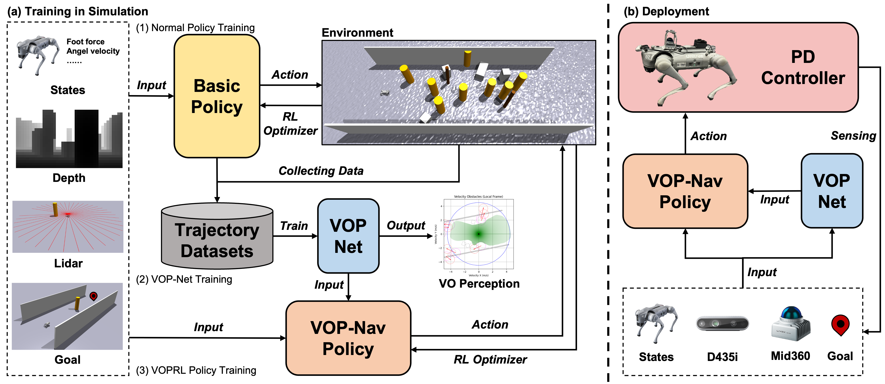

# VOP-Nav

## Learning Agile Navigation in Crowded Environments for Quadruped Robots

[Project page](https://sawyer-wu.github.io/Vop-Nav/) · **Code: Coming soon** · [arXiv](https://arxiv.org/abs/2607.15036)

## Abstract

Navigating dynamic and crowded environments presents significant challenges for quadruped robots due to severe sensor occlusion and unpredictable human motion. Existing approaches face a trade-off: model-based methods, such as Velocity Obstacles (VO), theoretically guarantee safety but rely on accurate obstacle motion estimates that often fail in dense crowds, while end-to-end learning methods offer robustness but lack motion prediction capability of obstacles, leading to collisions or conservative behaviors. To solve this, we propose VOP-Nav, a novel navigation system that combines the geometric safety of VO with the agile adaptability of end-to-end learning. Using only local onboard observations, our system avoids explicit obstacle detection and tracking pipelines. The VOP-Net processes multi-frame LiDAR data to implicitly encode dynamic constraints and predict a safe velocity region derived from Velocity Obstacle theory. Importantly, the VO predictions serve a dual role: they are used as input to the navigation policy during inference and as a reward signal during training to encourage safe motion. Evaluations in Isaac Gym demonstrate that VOP-Nav achieves higher success rates than all baselines while balancing locomotion speed and collision avoidance. Real-world deployment on a Unitree Go2 quadruped robot further validates the system's robustness and efficiency in complex indoor and outdoor dynamic environments.

## Framework

## Code

Coming soon.
